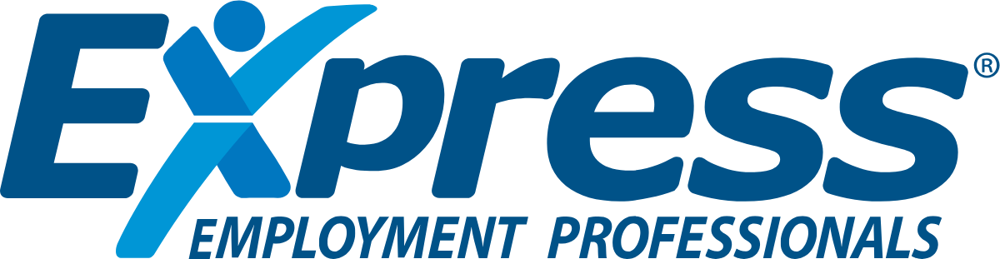

<p align="left">
  
</p>

# Express Employment Professionals ANZ, as code

The brand system for Express Employment Professionals in Australia and New Zealand, in a form an AI design tool can read as its single source of truth. Colours, type, logos, reference components, and the prose that explains all of it, in one repo that stays in sync with itself.

Built by [Jiffi](https://jiffi.co). Colour and logo values come from the *Express Employment Professionals Brand Guide* (revised June 2026), included at [`brand/express-brand-guide-2026-06.pdf`](./brand/express-brand-guide-2026-06.pdf). Web-layer values come from expresspros.com.au and expressfranchising.com.au.

## Use it

**In Claude Design, V0, Cursor, or Figma Make.** Link this repo as the design system. The tool reads [`CLAUDE.md`](./CLAUDE.md) first, which carries the non-negotiable rules and points at everything else.

**In a project.**

```bash
npm install github:jiffi-co/express-pros-brand
```

```css
@import "@jiffi-co/express-pros-brand/globals.css";
```

```ts
import { colors, colorsNoHash } from "@jiffi-co/express-pros-brand/tokens";
import preset from "@jiffi-co/express-pros-brand/tailwind";
```

`colorsNoHash` exists because PptxGenJS wants colours without the leading `#`. If you are building an Express deck, that is why it just works.

## What is in here

| Folder | What is in it |
| --- | --- |
| `tokens/` | `tokens.json` is the source of truth. `tokens.css`, `tokens.ts`, and the Tailwind v3 preset are generated from it and must not be hand-edited. On Tailwind v4, import `tokens.css` and map the `--brand-*` vars in `@theme` instead. |
| `fonts/` | Roboto and Roboto Condensed, self-hosted, with `fonts.css`. Apache 2.0. |
| `logo/` | 8 SVG and 8 PNG: the full lock-up and the standalone stylised X, each in the four permitted colour treatments. |
| `components/` | Nine reference components in React and Tailwind: Button, Card, Hero, CTASection, Nav, Footer, Logo, StatCallout, XBand. |
| `examples/` | A full landing page, a proposal cover, and two slide layouts. All render from the tokens, so they double as proof the system holds. |
| `styles/` | `globals.css`. One import brings fonts, tokens, element defaults, and both registers. |
| `brand/` | Seven markdown docs plus the official brand guide PDF. This is where the thinking lives. |
| `scripts/` | The token generator, the logo generator, and a contrast verifier. |

There is no `imagery/` folder. Express's photography is licensed to Express, so [`brand/photography.md`](./brand/photography.md) documents the direction instead of shipping files.

## The two registers

Express speaks in two visual registers and this system carries both. Corporate is the default: sentence case, Roboto, deep blue, 1200px. Set `data-brand-mode="franchise"` on a root element and headings become Roboto Condensed with h1 and h2 in caps, actions turn purple, and the container widens to 1400px, matching expressfranchising.com.au.

They never mix on one page. [`brand/visual-system.md`](./brand/visual-system.md) has the full table.

## Verify it

```bash
npm install
npm run verify
```

That regenerates the three derived token files from `tokens.json`, recomputes all 38 documented contrast pairings plus the four banned ones, and typechecks every component. If you change a colour and break a pairing the brand docs claim, this fails.

## The docs

| | |
| --- | --- |
| [overview.md](./brand/overview.md) | Who Express is, the numbers with their sources, the brand family, the vocabulary |
| [voice.md](./brand/voice.md) | How they sound, with a do and do-not table and a banned list |
| [visual-system.md](./brand/visual-system.md) | Colour, contrast contract, type, shape, logo rules, the two registers |
| [messaging.md](./brand/messaging.md) | Headline formulas, approved CTAs, copy blocks you can lift |
| [services.md](./brand/services.md) | The service lines, engagement types, and the franchise offer |
| [team.md](./brand/team.md) | The ANZ corporate team |
| [photography.md](./brand/photography.md) | The image direction, and what to request |

## Licensing

Express brand assets belong to Express Services, Inc. Roboto is Apache 2.0. Proxima Nova and Myriad Pro are commercially licensed and not vendored. See [LICENSE](./LICENSE).

---

**Agents:** start at [CLAUDE.md](./CLAUDE.md).
